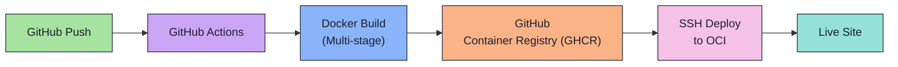
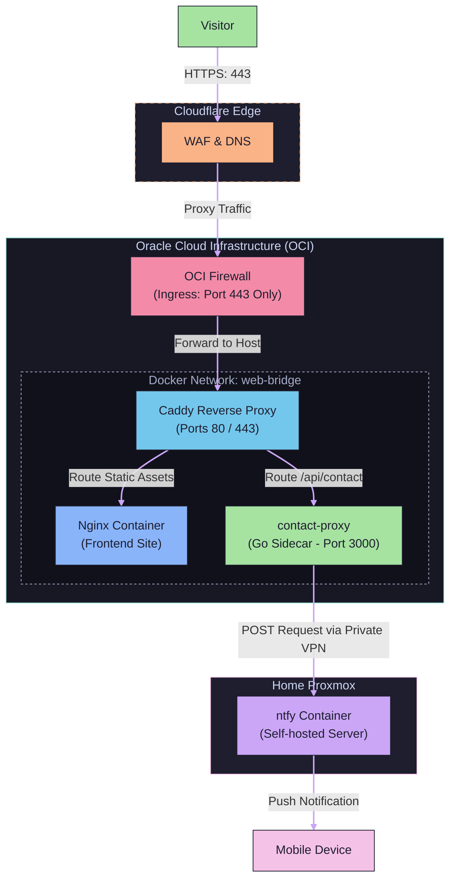

# Hi, I'm Emilio Velázquez 👋
### DevOps Engineer & Infrastructure Analyst

Based in **Asunción, Paraguay**, I specialize in designing, automating, and securing critical self-hosted and cloud infrastructure.

[🌐 Portfolio Website](https://gateway.cosmoslabs.work/) • [💼 LinkedIn Profile](https://linkedin.com/in/emiliovlz) • [✉️ Email Me](mailto:emilio.velazquez@cosmoslabs.work)

---

### 🚀 About Me
I'm a Systems and Infrastructure Engineer transitioning to DevOps. I have hands-on experience managing mission-critical enterprise environments, including core financial platform migrations and identity-based network access controls. I specialize in designing, automating, and securing self-hosted infrastructure using modern methodologies like GitOps, containerization, and Infrastructure as Code (IaC).

- 🔭 **Current Role**: Infrastructure Analyst at **Bolsa de Valores de Asunción** (Paraguay Stock Exchange), where I played a key technical role migrating core systems to a Nasdaq-powered trading platform.
- 🎓 **Education**: Studying Computer Engineering (*Ing. en Informática*) at **Universidad Autónoma de Asunción** (2019 – Present).
- 💬 **Ask me about**: Self-hosting, homelabs, container security, network hardening, or Zero Trust architecture.
- ⚡ **Fun Fact**: I find a well-reasoned critique far more satisfying than an unearned compliment.

---

### 🛠️ Tech Stack & Skills

| Category | Tools & Technologies |
| :--- | :--- |
| **Cloud & Virtualization** |       |
| **Automation & CI/CD** |      |
| **Networking & Security** |  `802.1X` `MAB` `IPSec VPN` `BGP` `OSPF` `EDR` `WAF` `IDS/IPS` |
| **Web Servers & Databases** |      |
| **Monitoring & Home Lab** |    |

---

### 📂 Featured Project: [Self-Hosted DevOps Portfolio](https://gateway.cosmoslabs.work/)
A highly available, secure portfolio website architected with strict security hardening and modern CI/CD GitOps practices.

#### ⚙️ Continuous Delivery Pipeline

#### 🌐 Deployment Topology

#### 🔒 Security Architecture
* **Container Hardening**: Frontend is powered by `nginx:alpine` (~25MB) and the Go backend sidecar `contact-proxy` (~8MB) runs on `distroless/static` with non-root execution and read-only filesystems.
* **Network Defense**: Strictly restricted OCI security list, Cloudflare Proxy (DDoS protection), Strict Content Security Policy (CSP), HTTP Strict Transport Security (HSTS), 3-layer rate limiting (10 req/min), and honeypot validation for spam defense.

---

### 💼 Professional Experience

#### **Infrastructure Analyst** @ Bolsa de Valores de Asunción *(2025 - Present)*
* Played a key technical role in the migration of the organization's core systems to a **Nasdaq-powered trading platform**.
* Architected and implemented a dynamic identity-based **Network Access Control (NAC)** system utilizing **802.1X** and **MAB** protocols.
* Migrated legacy systems to modern virtualized infrastructure using **Docker containerization** across hybrid environments.
* Designed and implemented automated **CI/CD pipelines** to streamline deployment processes.
* Administered IPSec VPNs, firewall policies, and network segmentation following **Zero Trust principles**.
* Deployed and managed **monitoring and alerting solutions** to ensure high availability and performance of critical systems.

#### **IT Coordinator** @ Club Centenario *(2023 - 2025)*
* Deployed and administered centralized security solutions including **EDR, WAF, and IDS/IPS systems**.
* Managed complex networks and oversaw the end-to-end lifecycle of internal IT infrastructure (150+ endpoints).
* Implemented automated backup and disaster recovery procedures ensuring business continuity.
* Administered relational databases and maintained continuous monitoring and alerting systems.

#### **IT Assistant** @ Club Centenario *(2021 - 2022)*
* Performed critical corrective and preventive hardware maintenance.
* Provided comprehensive Tier-1 support for organizational staff.

---

### 🏆 Credentials & Certifications
* **EF SET Certificate (C2 Proficient)** — Issued by EF SET (April 2025)
* **Microsoft Certified: Security, Compliance, and Identity Fundamentals** (October 2024)
* **Microsoft Certified: Azure Fundamentals** (August 2024)

---
<!-- Proudly created with love and refined manually -->
